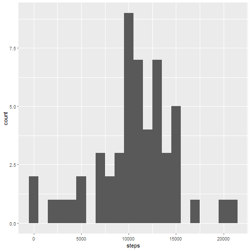
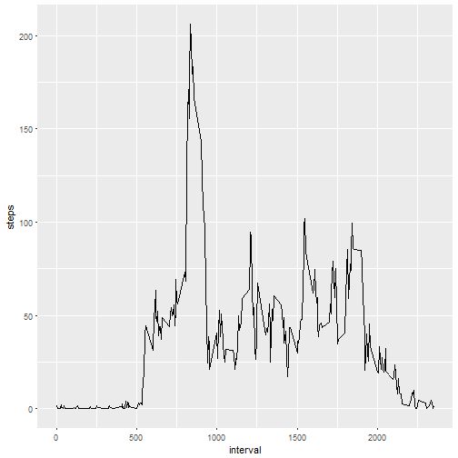
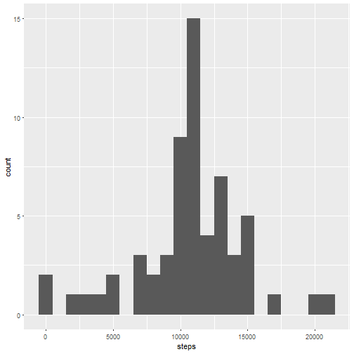
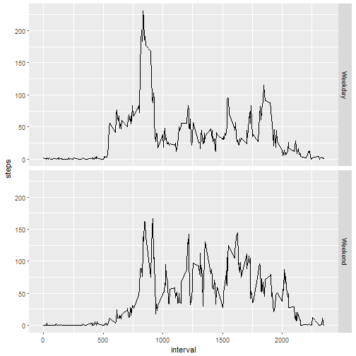

# Reproducible Research: Week 2 Assessment

## Loading and preprocessing the data

###1. Loading Data and validating


```r
    setwd("C:/r/GitHub/RepData_PeerAssessment1")
    unzip("activity.zip")
    activity_data <- read.csv("activity.csv")
    str(activity_data)
```

```
## 'data.frame':	17568 obs. of  3 variables:
##  $ steps   : int  NA NA NA NA NA NA NA NA NA NA ...
##  $ date    : Factor w/ 61 levels "2012-10-01","2012-10-02",..: 1 1 1 1 1 1 1 1 1 1 ...
##  $ interval: int  0 5 10 15 20 25 30 35 40 45 ...
```

```r
    summary(activity_data)
```

```
##      steps                date          interval     
##  Min.   :  0.00   2012-10-01:  288   Min.   :   0.0  
##  1st Qu.:  0.00   2012-10-02:  288   1st Qu.: 588.8  
##  Median :  0.00   2012-10-03:  288   Median :1177.5  
##  Mean   : 37.38   2012-10-04:  288   Mean   :1177.5  
##  3rd Qu.: 12.00   2012-10-05:  288   3rd Qu.:1766.2  
##  Max.   :806.00   2012-10-06:  288   Max.   :2355.0  
##  NA's   :2304     (Other)   :15840
```

```r
    head(activity_data)
```

```
##   steps       date interval
## 1    NA 2012-10-01        0
## 2    NA 2012-10-01        5
## 3    NA 2012-10-01       10
## 4    NA 2012-10-01       15
## 5    NA 2012-10-01       20
## 6    NA 2012-10-01       25
```

```r
    library(ggplot2)
```

###2. Preprocessing for removing NA data to produce efficiently results


```r
    activity_data_NoNA <- na.omit(activity_data)
```

## What is mean total number of steps taken per day?

###1.  Total number of steps taken per day


```r
    steps_per_day <- summarize(group_by(activity_data_NoNA, date),steps=sum(steps))
```

###2.  Plot histogram of the total number of steps taken each day


```r
    qplot(steps, data=steps_per_day, binwidth=1000)
```



###3.  Calculating mean & median


```r
    mean(steps_per_day$steps)
```

```
## [1] 10766.19
```

```r
    median(steps_per_day$steps)
```

```
## [1] 10765
```


## What is the average daily activity pattern?


###1.  Time series plot


```r
    mean_steps_interval <- summarize(group_by(activity_data_NoNA, interval), steps=mean(steps))
    
    ggplot(mean_steps_interval, aes(interval, steps)) + geom_line()
```



###2.  Maximum number of steps 


```r
    mean_steps_interval[which.max(mean_steps_interval$steps),]
```

```
## # A tibble: 1 x 2
##   interval steps
##      <int> <dbl>
## 1      835  206.
```

## Imputing missing values

###1.  Total number of rows with NA's


```r
    nrow(activity_data) - nrow(activity_data_NoNA)
```

```
## [1] 2304
```

###2.  Adding interval mean column to initial dataset


```r
    names(mean_steps_interval)[2] <- "mean_steps"
    
    act_data_replaced_NA_with_mean <- merge(activity_data, mean_steps_interval)
```

###3.  Replacing NA data with interval mean


```r
    act_data_replaced_NA_with_mean$steps[is.na(act_data_replaced_NA_with_mean$steps)] <- act_data_replaced_NA_with_mean$mean_steps[is.na(act_data_replaced_NA_with_mean$steps)]
```

###4.  Plot with NA replaced with mean data. Calculating mean and median with new data show differences. Mean is same but meadian has changed and increased in NA replaced with mean data.


```r
    steps_per_day_NA_filled_with_mean <- summarize(group_by(act_data_replaced_NA_with_mean, date),steps=sum(steps))
    
    qplot(steps, data=steps_per_day_NA_filled_with_mean, binwidth=1000)
```



```r
    mean(steps_per_day_NA_filled_with_mean$steps)
```

```
## [1] 10766.19
```

```r
    median(steps_per_day_NA_filled_with_mean$steps)
```

```
## [1] 10766.19
```


## Are there differences in activity patterns between weekdays and weekends?

###1. New factor variable and bucketed data for Weekday & Weekend


```r
    act_data_replaced_NA_with_mean$dayofweek <- weekdays(as.Date(act_data_replaced_NA_with_mean$date))
    
    act_data_replaced_NA_with_mean$weekend <- as.factor(act_data_replaced_NA_with_mean$dayofweek=="Saturday"|act_data_replaced_NA_with_mean$dayofweek=="Sunday")
    
    levels(act_data_replaced_NA_with_mean$weekend) <- c("Weekday", "Weekend")
    
    activity_weekday <- act_data_replaced_NA_with_mean[act_data_replaced_NA_with_mean$weekend == 'Weekday',]
    activity_weekend <- act_data_replaced_NA_with_mean[act_data_replaced_NA_with_mean$weekend == 'Weekend',]
```

###2. Plot - There is a difference between weekend and weekday activity. Weekdays are more active.


```r
    mean_steps_interval_weekday <- summarize(group_by(activity_weekday, interval), steps=mean(steps))
    mean_steps_interval_weekday$type <- "Weekday"

    mean_steps_interval_weekend <- summarize(group_by(activity_weekend, interval), steps=mean(steps))
    mean_steps_interval_weekend$type <- "Weekend"
    
    mean_steps_interval <- rbind(mean_steps_interval_weekday, mean_steps_interval_weekend)
    
    mean_steps_interval$type <- as.factor(mean_steps_interval$type)
    
    ggplot(mean_steps_interval, aes(interval, steps)) + geom_line() + facet_grid(type ~ .)
```



